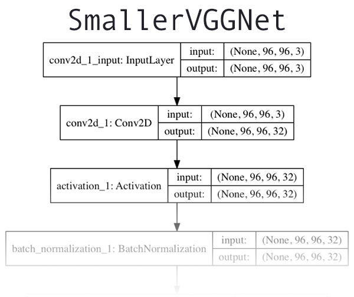
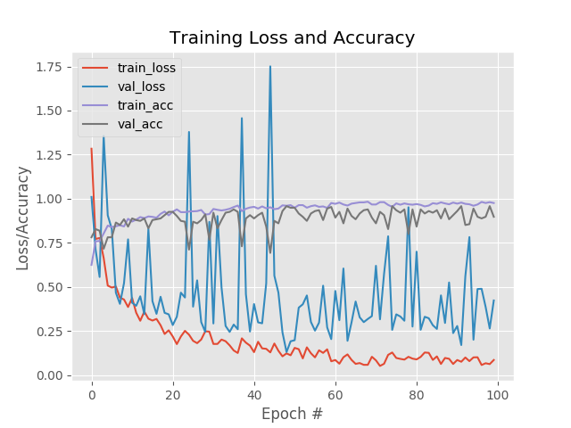
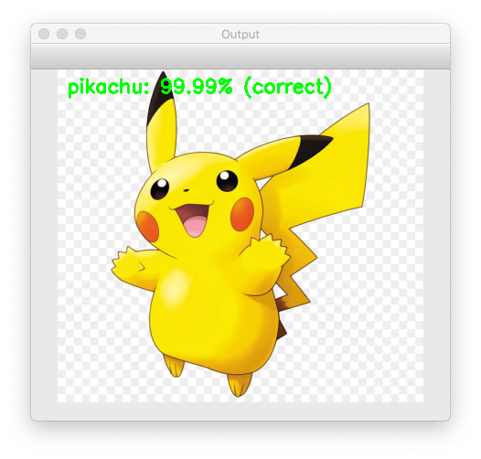
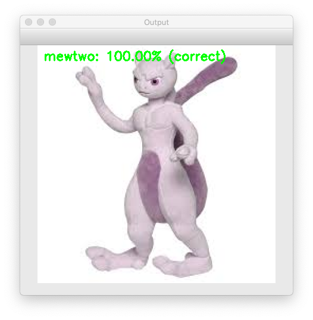
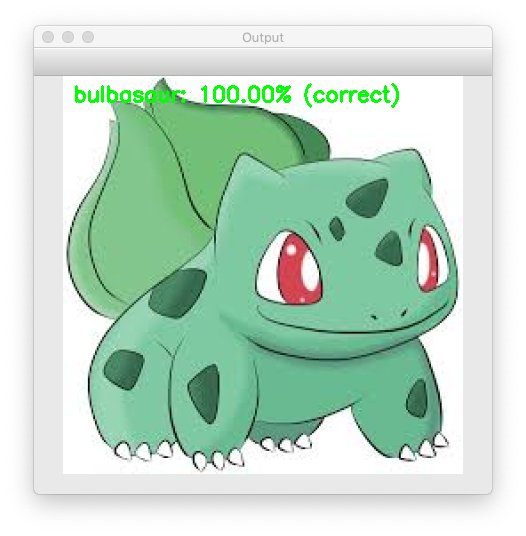
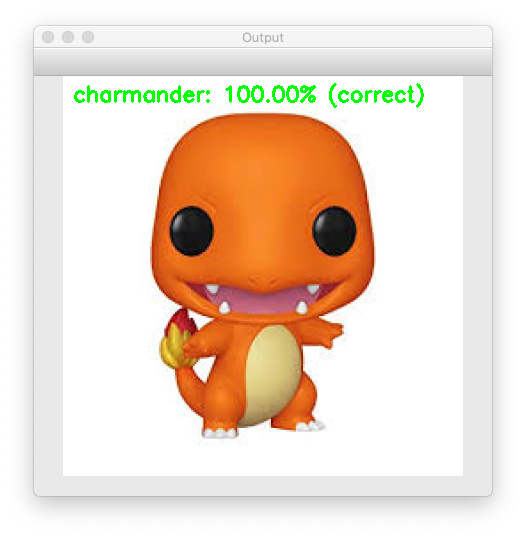
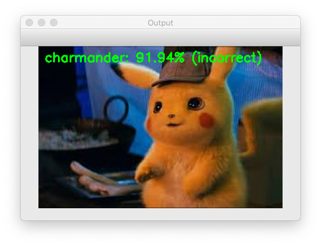

# Pokemon Classification

## Dataset
1. Create dataset using bing API
    - [Bing Image Search API](https://azure.microsoft.com/en-us/try/cognitive-services/?api=bing-image-search-api)
    - Refer search_bing_api.py

2. Dataset Structure
    - 194 files in directory ./dataset/squirtle
    - 229 files in directory ./dataset/pikachu
    - 201 files in directory ./dataset/charmander
    - 241 files in directory ./dataset/mewtwo
    - 210 files in directory ./dataset/bulbasaur

## Train

1. Network Structure

    

    - Using only 3×3 convolutional layers stacked on top of each other in increasing depth
    - Reducing volume size by max pooling
    - Fully-connected layers at the end of the network prior to a softmax classifier

2. Result
    - 97.21% classification accuracy on the training set
    - 92.56% accuracy on the testing set
    

## Test

1. Test Example

    
    
    
    

2. Error Example
    

3. Limitations
    - Small amount of training data. Ideally, we should have at least 500-1,000 images per class when training a Convolutional Neural Network
    - limitation of dataset coverage. The training images are mostly from cartoon illustration and toy plushes.
    - Include a background class to ignore the irrelevant object.

## CoreML

- We can easily tranfer our Keras model to CoreML model using the Apple coremltools.

- Refer coremlconverter.py

